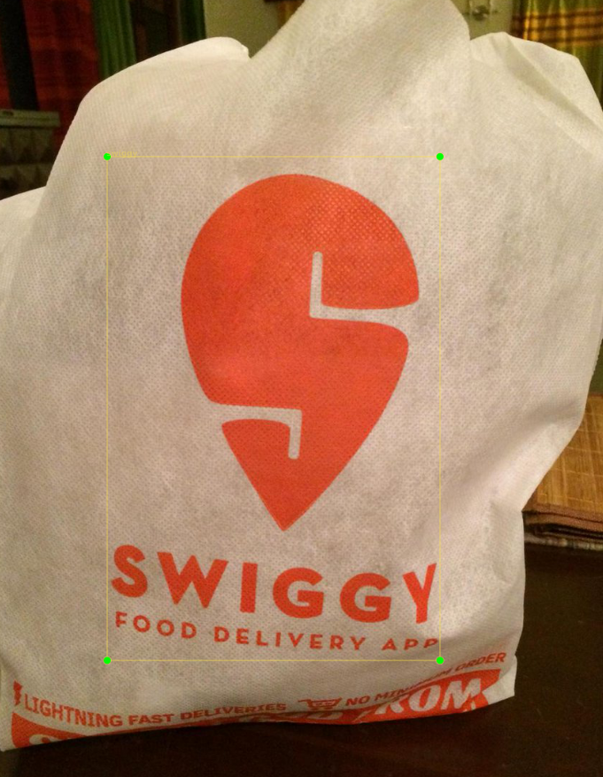
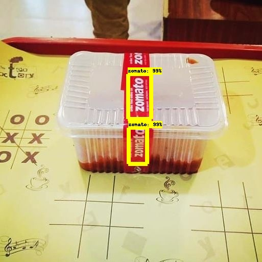
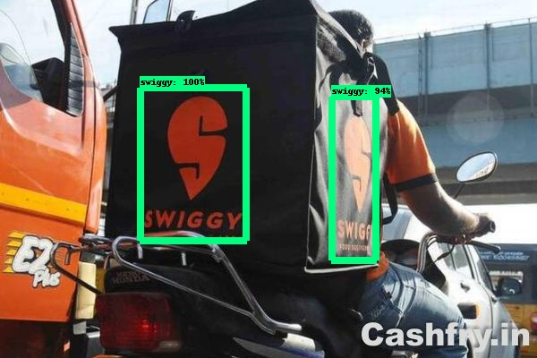

# Brand Recognition from food packages

In this project, we will detect which brand it is using the package image or video.
To recognize a brand we will use its logo. 

We will use transfer learning which is to train a pre-trained model, instead of training from scratch.
Transfer learning is fast and takes much fewer data to train.

### Requirements
Follow [this](https://github.com/tensorflow/models/blob/master/research/object_detection/g3doc/installation.md) readme.
Other than that clone this repository: https://github.com/tensorflow/models and name it as models.<br>

For Linux and Windows users, you should create a virtual environment, you can use conda for that.<br>
All the training should be done in that virtual environment.<br>
After creating the environment, you need to run few commands.<br>
Go to the models/research/ folder and run these command to 
1. Compile all the protobuf libraries
```bash
protoc object_detection/protos/*.proto --python_out=.
```
2. Append the libraries to PYTHONPATH
```bash
export PYTHONPATH=$PYTHONPATH:`pwd`:`pwd`/slim
```

You can test your installation using the following command
```bash
python object_detection/builders/model_builder_test.py
```
If you get no error you are good to go, otherwise go throught the above commands patiently.


## Collecting data and labeling it

Collect as much data as you can. Taking a package and then clicking its pictures in various environments and orientations,<br> 
for example, It should contain images where the logo is overlapped by other objects.<br>
Make sure that the files are of jpg extension only. If not then convert them to jpg using the script `convert_to_jpg.py` given in this repo.

Labeling is done using `LabelImg`, you can find it here: https://github.com/tzutalin/labelImg.<br>
LabelImg is a graphical image annotation tool. Annotations are saved as XML files. The installation and running instructions are written in repository.<br>
Store the images in the `train` and `test` folders.



## Converting xml files to TFRecord

TFRecord files are binary files which take less space, takes less time to copy and read. It is optimized for use with Tensorflow in multiple ways. 
Since we are going to use tensorflow model we need to convert .XML files to .record files.

To do this conversion we first convert XML to CSV file. To do this we have a python script named `xml_to_csv.py` in this repo.<br>
Make sure that this file is present in the same directory where train and test folders are placed and run using 
```bash
python xml_to_csv.py
```
After you run this script you will find 2 CSV files each for train and test in the data folder.

Now we will convert the .csv files to .record files. We will use `generate_record_files.py` to do this operation.<br>
First, make sure that you have this file in the directory containing data folder and folder containing the actual images.<br>
Change the class_text_to_int function in the file.<br>
Then run these commands 

For training
```bash
python generate_record_files.py --csv_input=data/train_labels.csv  --output_path=data/train.record --image_dir=images/
```

For test
```bash
python generate_record_files.py --csv_input=data/test_labels.csv  --output_path=data/test.record --image_dir=images/
```

here images/ is the folder containing the actual data images.<br>
After running this command you will have 2 .record files in your data folder.<br>
Cut this data folder and move it inside the models/research/object_detection/ folder in the models repository you cloned earlier, as written in requirement section. 

## Training the model

#### Which model to choose
As in the beginning, we said that we can train the pre-trained model or train it from scratch. We will do the transfer training and training the pre-trained model.
First, we should choose the model. Go to this [repository](https://github.com/tensorflow/models/blob/master/research/object_detection/g3doc/detection_model_zoo.md). 
Tenserflow provide various object detection models which are pre-trained and have specific neural network architecture.<br>
Models are given with their speed and accuracy. If you are planning on using this model in the device with low computational power use ssd_mobilenet.<br>
as they are fast but have low accuracy. In case of devices like laptops use the faster_rcnn models.<br>

#### Getting the configuration file
We used the faster_rcnn_inception_v2_coco model to train.<br>
Download it and extract it to the models/research/object_detection/ directory.<br>
Now you need the configuration file of this model. Download it from [here](https://github.com/tensorflow/models/tree/master/research/object_detection/samples/configs).

#### Changes in the configuration file
You need to make certain changes in this configuration file. Replace the PATH_TO_BE_CONFIGURED to the desired location.<br>
Change the num_classes in faster_rcnn to the number of classes you have. As we have 2, swiggy and zomato.<br>
Change the num_examples in eval_config to number of test images you have.<br>
Check the faster_rcnn_inception_v2_coco.config for more clarification.

#### Getting the label_map 
Label map is a dictionary containing the id and name of classes you want to detect.
See the label_map.pbtxt for more clarification.

Now make a new folder inside the models/research/object_detection/ folder and name it training. Now move the configuration and label map file into this folder.

#### Running the model
If you have followed all the previous steps you will get no error.<br>
Get into the models/research/object_detection/ folder.<br>
Run the following command in your terminal, and do change the config file name before you run.
```bash
python3 train.py --logtostderr --train_dir=training/ --pipeline_config_path=training/faster_rcnn_inception_v2_coco.config
```

Your training will start and you will see some like<br>
INFO:tenserflow:global step n: loss = __(_.__ steps/sec)<br>

When this n reach some 50,000 you can press Ctrl-C to stop the process


## Testing the output
First we need to export the inference graph. To do this run this command.<br>
Before running, do change the model.ckpt-AAAAA with the one with largest AAAAA. You will find this in training folder.
```bash
!python export_inference_graph.py --input_type image_tensor --pipeline_config_path training/faster_rcnn_inception_v2_coco.config --trained_checkpoint_prefix training/model.ckpt-AAAAA --output_directory inference_graph
```
This command will create a frozen_inference_graph.pb file in inference_graph folder. This is the file which we will use to produce the result.<br>
At the end we used the command 
```bash
python testing_image.py
```
You can get the file from the repository.<br>
Do change the NUM_CLASSES to number of classes or categories you are using, change the path.<br>
And you will get the labelled images like this.





